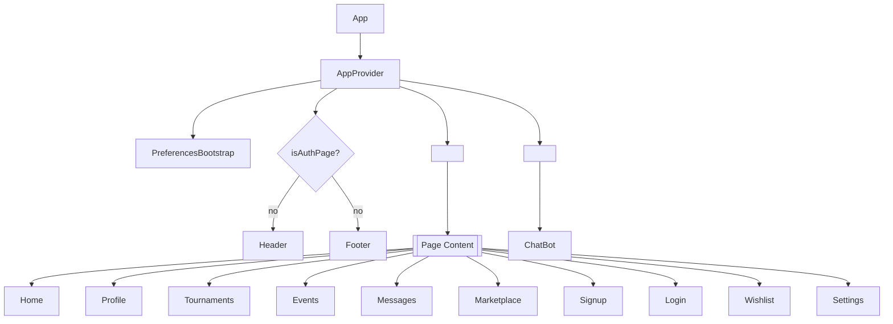
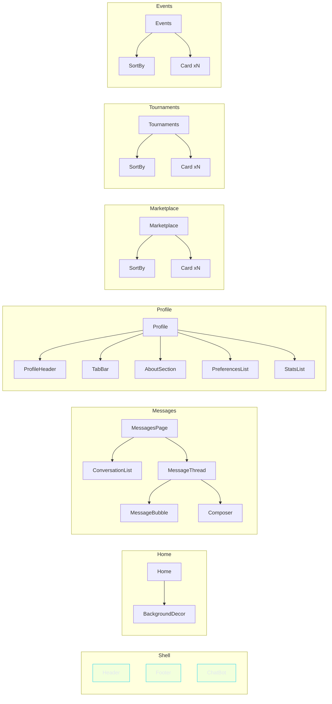

# GamerMajlis Frontend

A modern React 19 gaming platform with TypeScript, Vite, and Tailwind CSS. Features responsive design, RTL support, in### Recent updates (September 2025)

#### Major Infrastructure Overhaul

- **Form System Refactoring**: Eliminated 240+ lines of duplicate form code with unified `InputField` component
- **Validation Infrastructure**: Implemented comprehensive form validation with `useFormValidation` hook
- **Performance Optimization**: Added debouncing to all search interfaces (Events, Tournaments, Marketplace)
- **State Management**## Major Infrastructure Updates (September 2025)

### Form & Validation System

- **373 lines eliminated** through unified `InputField` component and `useFormValidation` hook
- **Real-time validation** with touch-based error display and accessibility support
- **Type-safe form handling** with comprehensive error boundaries

### Performance Optimizations

- **Debounced search** (300ms) across Events, Tournaments, and Marketplace
- **Click-outside detection** centralized with `useClickOutside` hook
- **Strategic memoization** of leaf components with stable callback patterns
- **LocalStorage management** with type safety and error handling

### Component Architecture

- **Custom hooks ecosystem**: 8 specialized hooks for reusable logic
- **Error boundaries** with development-friendly debugging
- **Unified component exports** through barrel pattern
- **Comprehensive TypeScript** coverage with centralized type definitionslized localStorage management with type safety and error handling
- **Click Detection**: Unified click-outside behavior across dropdowns and menus
- **Error Handling**: Added error boundaries with development-friendly debugging
- **Component Architecture**: Created comprehensive component library with proper TypeScript definitions

#### Authentication & Forms

- **Login/Signup Refactoring**: Complete migration to new form infrastructure with real-time validation
- **Input Field Component**: Unified component with floating labels, password visibility, error states, and RTL support
- **Form Validation**: Email, password, username validation with consistent error messaging
- **Accessibility**: Proper ARIA labels, focus management, and error announcements

#### Search & Performance

- **Debounced Search**: 300ms debounce implemented across all search interfaces
- **Mobile Optimizations**: Simplified search UI on mobile with icon buttons and shortened placeholders
- **Sort Components**: Unified dropdown behavior with click-outside detection
- **Memoization**: Strategic component memoization for performance optimization

#### Navigation & UI

- **Header Improvements**: Enhanced contrast for desktop navigation and simplified mobile dropdown
- **Profile Dropdown**: Clean user menu with Profile, Wishlist (with badge), Settings, and Logout options
- **Mobile Navigation**: Streamlined hamburger menu with proper RTL support
- **Component Consistency**: Standardized click-outside behavior across all interactive elementsionalization, comprehensive form validation, and a robust component-driven architecture.

## Tech Stack

- **React 19** with TypeScript for modern component development
- **Vite 7.1.4** for fast development and optimized builds
- **Tailwind CSS 3.4.14** for utility-first styling
- **react-i18next** for internationalization with English/Arabic support
- **Node** (npm/pnpm) or **Bun** for package management and scripts

## Key Infrastructure

- **Custom Hooks System**: Comprehensive form validation, debounced search, click-outside detection, and localStorage management
- **Reusable Components**: Centralized InputField component with error handling and validation
- **Error Boundaries**: Robust error handling with fallback UI and development debugging
- **Performance Optimized**: Memoized components and debounced search across all interfaces

## Project structure (current)

```
src/
├── components/
│   ├── shared/                  # Shared UI components with modern infrastructure
│   │   ├── BackgroundDecor.tsx  # Decorative background element
│   │   ├── Card.tsx             # Reusable card component
│   │   ├── ChatBot.tsx          # Chat interface (lazy-loaded)
│   │   ├── ErrorBoundary.tsx    # Error boundary with fallback UI
│   │   ├── Footer.tsx           # Site footer
│   │   ├── Header.tsx           # Main navigation with click-outside detection
│   │   ├── icons.tsx            # Shared SVG icon components
│   │   ├── InputField.tsx       # Unified form input with validation
│   │   ├── LanguageSwitcher.tsx # Language toggle (EN/AR)
│   │   ├── Logo.tsx             # Brand logo component
│   │   ├── SortBy.tsx           # Reusable sort dropdown with click-outside
│   │   ├── SuspenseWrapper.tsx  # Loading states and lazy loading
│   │   └── index.ts             # Barrel exports for all shared components
│   ├── messages/                # Message-related components
│   │   ├── Composer.tsx         # Message input composer
│   │   ├── ConversationList.tsx # Sidebar conversation list
│   │   ├── MessageBubble.tsx    # Individual message display
│   │   ├── MessageThread.tsx    # Message thread container
│   │   └── index.ts             # Message component exports
│   ├── profile/                 # Profile page components
│   │   ├── AboutSection.tsx     # Profile bio editor/view
│   │   ├── PreferencesList.tsx  # Editable list of user preferences
│   │   ├── ProfileHeader.tsx    # Composite header (avatar, name, XP, actions)
│   │   ├── StatsList.tsx        # Editable stats with progress
│   │   └── TabBar.tsx           # Profile tabs (About/Preferences/Stats)
│   ├── settings/                # Settings-specific components
│   │   ├── Dropdown.tsx         # Settings dropdown component
│   │   ├── SettingRow.tsx       # Individual setting row
│   │   ├── ToggleButton.tsx     # Toggle switch component
│   │   └── index.ts             # Settings component exports
│   └── index.ts                 # Main component barrel
├── config/                      # Configuration and constants
│   ├── constants.ts             # App constants, validation rules, breakpoints
│   └── index.ts                 # Config exports
├── context/
│   ├── AppContext.tsx           # Global application state with localStorage
│   └── useAppContext.ts         # Context hook
├── hooks/                       # Custom hooks for reusable logic
│   ├── useApi.ts                # API request management with retry logic
│   ├── useClickOutside.ts       # Click outside detection hook
│   ├── useDebounce.ts           # Value and callback debouncing
│   ├── useFormValidation.ts     # Comprehensive form validation
│   ├── useIsMobile.ts           # Mobile viewport detection
│   ├── useLocalStorage.ts       # Type-safe localStorage management
│   ├── usePreferences.ts        # User preferences synchronization
│   └── index.ts                 # Hook exports
├── pages/
│   ├── Events.tsx               # Events page with debounced search
│   ├── Home.tsx                 # Landing page hero
│   ├── Login.tsx                # Authentication form with validation
│   ├── Marketplace.tsx          # Product marketplace with optimized search
│   ├── Messages.tsx             # Messages page with conversation management
│   ├── Profile.tsx              # User profile page with enhanced design
│   ├── Settings.tsx             # User settings and preferences
│   ├── Signup.tsx               # User registration with form validation
│   ├── Tournaments.tsx          # Tournaments listing with search
│   ├── Wishlist.tsx             # User wishlist with localStorage
│   └── index.ts                 # Page exports
├── services/
│   └── AuthService.ts           # Authentication service with localStorage
├── states/
│   └── EmptyState.tsx           # Shared empty state UI
├── styles/
│   ├── BaseStyles.ts            # Design tokens and utilities
│   └── options/                 # Style documentation
├── types/                       # TypeScript type definitions
│   ├── auth.ts                  # Authentication and user types
│   ├── common.ts                # Base component and utility types
│   ├── data.ts                  # Data model types
│   ├── forms.ts                 # Form validation and field types
│   ├── ui.ts                    # UI component prop types
│   └── index.ts                 # Type exports
├── data/                        # Static data and configurations
├── i18n/                        # Internationalization
└── App.tsx                      # Main application with error boundaries

public/
└── locales/                     # Translation files
    ├── en/translation.json      # English translations
    └── ar/translation.json      # Arabic translations
```

## Key Features

### Modern Infrastructure (September 2025)

- **Unified Form System**: Centralized `InputField` component with built-in validation, error handling, and accessibility
- **Custom Hooks Ecosystem**:
  - `useFormValidation`: Comprehensive form validation with common rules
  - `useLocalStorage`: Type-safe localStorage with automatic persistence
  - `useDebounce`: Optimized search performance (300ms across all interfaces)
  - `useClickOutside`: Centralized click-outside detection for dropdowns
  - `useApi`: Robust API management with retry logic and error handling
- **Error Boundaries**: Development-friendly error catching with fallback UI
- **Performance Optimized**: Memoized components and stable callback patterns
- **Type Safety**: Comprehensive TypeScript coverage with centralized type definitions

### Responsive Design

- **Mobile-first approach** with Tailwind breakpoints: `sm` (640px), `md` (768px), `lg` (1024px), `xl` (1280px)
- **Adaptive header**:
  - Desktop: centered pill-style nav with high-contrast frame and hover states
  - Mobile: simple dropdown list with click-outside detection
- **Responsive components** optimized for all screen sizes with mobile-specific optimizations

### Form Validation & User Experience

- **Real-time validation**: Field-level validation with touch-based error display
- **Common validation rules**: Email, password, username patterns with consistent messaging
- **Accessible forms**: Proper ARIA labels, focus management, and error announcements
- **Debounced search**: 300ms debounce across Events, Tournaments, and Marketplace for optimal performance

### Internationalization (i18n)

- **Bilingual support**: English and Arabic with RTL layout
- **RTL handling**: document `dir` is synced to the active language; sensitive components set `dir` explicitly and use direction-aware spacing/alignment
- **Dynamic font pairing** (Latin + Arabic-friendly fonts)
- **Layout mirroring** for proper RTL experience

### Recent updates (September 2025)

- Navigation
  - Desktop: increased contrast of the nav “pill” frame for clarity
  - Mobile: simplified menu to a dropdown below the header; minimalist hamburger; profile dropdown includes Profile, Wishlist (badge), Settings, Logout with RTL-aware alignment
- Search & Sort (Marketplace / Tournaments / Events)
  - On mobile: hide SortBy, shorten search placeholder to “Search”, add a small search icon button that focuses the input
  - Added `IconSearch` and a tiny `useIsMobile` hook (640px breakpoint)
- Home page
  - Mobile: CTA buttons reduced in size and set to ~half-width side-by-side
  - Labels updated to “Subscribe” and “Tournaments” (with translations)
- i18n

  - Persist language across refresh; namespace loading and debug logs refined

- Profile refactor and cleanup

  - Introduced a composite `ProfileHeader` that encapsulates avatar picker, name/discord editing, level + XP progress (via `ProgressBar`), and edit/save/cancel actions.
  - Split Profile content into `TabBar`, `AboutSection`, `PreferencesList`, and `StatsList` for clarity and reuse.
  - Reduced component count by inlining header subcomponents to avoid over-fragmentation.

- Shared Empty State

  - Added `src/states/EmptyState.tsx` and adopted it in `Wishlist`, `Marketplace`, `Events`, and `Tournaments` for consistent empty views.
  - Localized messages and actions in both English and Arabic.

- Lifecycle fix

  - Moved `hashchange` side-effect from `useState` to `useEffect` in `App.tsx` with proper cleanup.

- Favicon stabilization

  - Switched to PNG-based favicons for consistent cross-browser rendering; added guidance for cache-busting.

- RTL and ChatBot fixes

  - Corrected RTL alignment and arrow flipping in ChatBot composer; reduced brand icon height; improved `dir` detection.

- Auth polish

  - Added responsive "Login with Discord" button using `react-icons`.
  - Fixed mobile viewport issues in `Signup.tsx` with responsive widths and layout.

- Performance and cleanup
  - Wrapped leaf components with `React.memo` to reduce unnecessary re-renders:
    - `src/components/shared/SortBy.tsx`
    - `src/components/profile/TabBar.tsx`
    - `src/components/profile/AboutSection.tsx`
    - `src/components/profile/PreferencesList.tsx`
    - `src/components/profile/StatsList.tsx`
  - Stabilized handler identities in `src/pages/Profile.tsx` using `useCallback` so memoized children don’t re-render on every parent update.
  - Adopted a `props.xxx` access style in child components for clarity and consistency.
  - Removed unused/empty files: `src/components/MobileMenu.tsx` and `src/services/Context7Service.ts`.

#### i18n: namespace loading and debug

When translations are loaded at runtime via the HTTP backend, i18next initialization and namespace loading are asynchronous. A common runtime warning is:

```
i18next::translator: key "labels.organizer" ... won't get resolved as namespace "translation" was not yet loaded
```

This happens when code calls `i18n.t(...)` before the backend has finished loading the requested namespace for the active language.

Project approach

- Centralized debug logging in `src/i18n/config.ts`; waits for namespaces via `i18n.loadNamespaces(ns)` before logging keys in dev.

How to verify

- Start the dev server and open browser DevTools Console. You should see a single grouped block per language titled `i18n translation debug: <lang>` with the requested keys and values (or a single clear missing warning if a key is not present).

Notes on Context7

- Context7 integration is currently deferred in this branch to keep the codebase lean. The previous placeholder service has been removed. If/when integration resumes, add back a service under `src/services/` and wire configuration via environment variables.

### Component architecture

- **Shared vs settings**: Components that are reused across pages live under `src/components/shared/` and are exported from the shared barrel (`src/components/shared/index.ts`). Settings-specific UI should live in `src/components/settings/` so contributors know which pieces are app-shell vs settings-only.
- **Single import entry**: Import shared components from the top-level barrel `src/components` (this file re-exports from `./shared`) rather than importing deep paths. Example:

```ts
// preferred
import { Header, Footer, Card } from "../components";

// avoid
import Header from "../components/shared/Header";
```

This keeps imports stable when components are reorganized and simplifies refactors.

## Application Structure (Parent → Children)

Below is a high-level parent/children map of the application using Mermaid for a clean visual. It focuses on the app shell and key pages. You can preview Mermaid diagrams directly on GitHub.



### Page Composition Details



Notes

- The shell (`Header`, `Footer`, `ChatBot`) is hidden on auth pages (`Login`, `Signup`).
- Pages are lazy-loaded via React `lazy` and wrapped in `Suspense`.
- Shared UI like `Card`, `SortBy`, `BackgroundDecor`, `Logo`, and icons live under `src/components/shared` and are imported through the barrel `src/components`.
- Navigation between pages is handled via the URL hash (e.g., `#home`, `#tournaments`), which the `App` component listens to and syncs.

### Changelog (structural)

- Removed files (inlined into `ProfileHeader`):

  - `src/components/profile/AvatarPicker.tsx`
  - `src/components/profile/NameSection.tsx`
  - `src/components/profile/LevelXp.tsx`
  - `src/components/profile/ActionButtons.tsx`

- Added files:

  - `src/states/EmptyState.tsx`
  - `src/components/profile/ProfileHeader.tsx` (composite)
  - `src/components/profile/TabBar.tsx`
  - `src/components/profile/AboutSection.tsx`
  - `src/components/profile/PreferencesList.tsx`
  - `src/components/profile/StatsList.tsx`

- Removed files (cleanup):
  - `src/components/MobileMenu.tsx` (unused after mobile dropdown rollback)
  - `src/services/Context7Service.ts` (deferred integration)

### State Management

- **React Context API** for global state with `useLocalStorage` hook for automatic persistence
- **Type-safe localStorage** with error handling and validation
- **Controlled components** with centralized form validation via `useFormValidation`
- **Error boundaries** for robust error handling and development debugging
- **Custom hooks** for reusable stateful logic across components

## Styling System

### Tailwind Configuration

The project uses Tailwind CSS 3.4.14 with custom theme extensions including the enhanced color palette:

```javascript
// tailwind.config.js
theme: {
  extend: {
    fontFamily: {
      alice: ["Alice-Regular", "Helvetica", "sans-serif"],
      scheherazade: ["Scheherazade New", "serif"],
      inter: ["Inter", "system-ui", "sans-serif"],
    },
    colors: {
      dark: "#0b132b",
      "dark-secondary": "#1e293b",
      primary: "#6fffe9",
      "primary-hover": "#5ee6d3",
      text: "#ffffff",
      "text-secondary": "#94a3b8",

      // Enhanced Palette Colors
      'rich-black': '#0B132B',
      'dark-gunmetal': '#1C2541',
      'independence': '#3A506B',
      'tiffany-blue': '#5BC0BE',
      'aquamarine': '#6FFFE9',
      'persian-green': '#07BEB8',
      'turquoise': '#3DCCC7',
      'medium-turquoise': '#68D8D6',
      'powder-blue': '#9CEAEF',
      'light-cyan': '#C4FFF9',
    },
  },
}
```

### Design Tokens

Design tokens are provided via Tailwind theme extension; component-level CSS variables can be added as needed.

### Layout Notes

- **Flexbox**: used heavily for header, toolbars, and linear layouts
- **CSS Grid**: used for content grids (e.g., product/tournament/event cards)

### Z-Index Layering

Consistent layering:

- **Background**: `z-0` (BackgroundDecor)
- **Content**: `z-10` (pages)
- **Navigation**: `z-50` (Header)
- **Dropdowns**: `z-[10001]` (mobile menu/profile)

## Development

### Modern Development Stack

This project features a comprehensive modern infrastructure designed for developer productivity and code quality:

- **373 lines eliminated** through intelligent abstraction and reusable components
- **8 custom hooks** providing consistent patterns for common use cases
- **Unified form system** with real-time validation and accessibility
- **Type-safe localStorage** with automatic persistence and error handling
- **Performance optimized** with debouncing and strategic memoization
- **Error boundaries** with development-friendly debugging

### Getting Started

```bash
# Install dependencies (choose one)
npm install
# or
pnpm install
# or
bun install

# Start development server
npm run dev
# or
bun run dev

# Build for production
npm run build

# Lint code
npm run lint
```

### Dev checklist

Quick, repeatable steps for local development and verification:

- Install dependencies

  ```bash
  npm install # or pnpm install / bun install
  ```

- Start the dev server and open the app (Vite default port 5173)

  ```bash
  npm run dev
  # then open http://localhost:5173
  ```

- Verify translations & RTL

  - Use the in-app LanguageSwitcher (top-right) to toggle between English and Arabic.
  - Alternatively, append `?lang=ar` or `?lang=en` to the URL to test language-specific load behavior.
  - Confirm translations persist across refresh and that the current page remains after reload (URL hash is synchronized with app state).
  - Confirm: Marketplace/Events/Tournaments sort dropdowns and product cards show translated labels and proper RTL alignment.

- Verify modern infrastructure

  - Test form validation by triggering validation errors in Login/Signup forms
  - Confirm debounced search behavior in Events, Tournaments, and Marketplace (300ms delay)
  - Test click-outside behavior on dropdown menus and profile menu
  - Verify localStorage persistence by refreshing the page with wishlist items
  - Check error boundary functionality by triggering component errors in development

- Smoke tests

  - Check the product card: no category badge on the card, localized "Buy Now"/"Details"/"No Image" strings, and review counts render via translations.
  - Open browser console to observe the centralized i18n debug block (dev only) and ensure there are no repeated "namespace not loaded" warnings.

- Build, typecheck & lint

  ```bash
  npm run build   # runs tsc -b && vite build
  npm run lint
  ```

- Preview production build

  ```bash
  npm run preview
  # then open the preview URL printed by Vite
  ```

- Commit & branch workflow

  ```bash
  git checkout -b feat/your-feature
  git add -A
  git commit -m "feat: short description"
  git push --set-upstream origin feat/your-feature
  ```

- Optional: quick translation parity check (node)

  This one-liner will list keys present in English but missing in Arabic. Run from the repo root (requires Node.js):

  ```bash
  node -e "const en=require('./public/locales/en/translation.json'); const ar=require('./public/locales/ar/translation.json'); const keys=(o)=>Object.keys(o).reduce((acc,k)=>{ if(typeof o[k]==='object') Object.keys((function f(x){return x})(o[k])||{}).forEach(sub=>acc.push(k+'.'+sub)); else acc.push(k); return acc; },[]); const flat=(o,p='')=>Object.entries(o).flatMap(([k,v])=>typeof v==='object'&&v!==null?flat(v,p?`${p}.${k}`:k):[(p?`${p}.`:'')+k]); const enKeys=flat(en); const arKeys=flat(ar); console.log('missing in ar:', enKeys.filter(k=>!arKeys.includes(k)).join('\n')||'none');"
  ```

If you'd like, I can add a small parity script to the repo and a package.json script for convenience.

### Key Development Patterns

#### Modern Infrastructure Usage

- **Custom Hooks**: Use specialized hooks for common patterns:

  ```typescript
  // Form validation
  const { values, errors, handleChange, handleBlur, submit } =
    useFormValidation(initialData, rules);

  // Debounced search
  const debouncedTerm = useDebounce(searchTerm, 300);

  // Click outside detection
  const ref = useClickOutside(() => setOpen(false));

  // Type-safe localStorage
  const [data, setData] = useLocalStorage("key", defaultValue);
  ```

- **Unified Components**: Use `InputField` for all form inputs:
  ```typescript
  <InputField
    name="email"
    type="email"
    value={formData.email}
    label={t("auth.email")}
    error={touched.email ? errors.email : undefined}
    onChange={handleInputChange}
    onBlur={() => handleInputBlur("email")}
    required
  />
  ```

#### Component Creation

- Use TypeScript interfaces for props
- Implement responsive design with Tailwind utilities
- Include RTL support for text-heavy components
- Export from appropriate index.ts files

#### Styling Approach

- **Tailwind utilities** for layout, spacing, and responsive design
- **CSS variables** for theme colors and consistent styling
- **Inline styles** only for dynamic or computed values
- **Component-specific styles** in BaseStyles.ts when needed

#### State Management

- Use React Context for global state
- Implement controlled components for forms
- Persist important data in localStorage
- Use proper TypeScript interfaces for state shape

### Browser Support

- **Modern browsers** with ES2020+ support
- **CSS Grid and Flexbox** for layouts
- **CSS custom properties** for theming
- **Responsive design** across all viewport sizes

### Performance Optimizations

- **Unified Infrastructure**: Custom hooks eliminate code duplication and provide consistent behavior
- **Debounced Search**: 300ms debounce across all search interfaces prevents excessive operations
- **Strategic Memoization**: Leaf components with primitive props wrapped in `React.memo`
- **Stable Callbacks**: Parent components use `useCallback` for function identity stability
- **Error Boundaries**: Prevent error cascades and provide graceful fallback UI
- **Tree Shaking**: Vite optimization with proper barrel exports for minimal bundle size
- **Fast Development**: Hot module replacement with optimized build pipeline

### Prop Style Convention

To keep code skimmable and consistent, child components use a single `props` parameter and access props as `props.xxx` instead of destructuring long lists at the top of the function. Rationale:

- Easier to scan and refactor, especially in components with many props
- Reduces churn when adding/removing props
- Plays nicely with inline IDE hovers and jump-to-def on `props`

## Changelog (Sep 2025)

- Desktop header nav frame made higher-contrast for easier evaluation
- Mobile header uses a simple dropdown (no overlay) and a minimal hamburger
- Mobile profile dropdown: Profile, Wishlist (badge), Settings, Logout; RTL aware
- Marketplace/Tournaments/Events (mobile): hide SortBy, shorten search placeholder to “Search”, add small search icon button
- Home (mobile): buttons reduced in size and set to ~half-width; labels changed to “Subscribe” and “Tournaments”
- New utilities: `useIsMobile` hook and `IconSearch`

## Architecture Decisions

### Modern Infrastructure

**Custom Hooks Pattern**: Centralized business logic through specialized hooks (`useFormValidation`, `useLocalStorage`, `useDebounce`, `useClickOutside`) eliminates code duplication and provides consistent behavior across components.

**Type-Safe Development**: Comprehensive TypeScript coverage with centralized type definitions in `/src/types/` ensures compile-time safety and excellent developer experience.

**Error Handling**: Development-friendly error boundaries with fallback UI and detailed debugging information improve development workflow.

### Form Architecture

**Unified Input System**: Single `InputField` component handles all form inputs with floating labels, validation states, password visibility, and RTL support, eliminating 240+ lines of duplicate code.

**Real-time Validation**: Touch-based validation system provides immediate feedback without overwhelming users with premature error states.

### Performance Strategy

**Debounced Interactions**: 300ms debounce on all search interfaces prevents excessive API calls and improves user experience.

**Strategic Memoization**: Leaf components with primitive props are memoized, while parent components use `useCallback` for stable function references.

### Navigation

Hash-based SPA navigation with manual page state management in App.tsx, avoiding the complexity of a full router for this application size.

### Styling Strategy

Tailwind-first approach with design tokens and CSS variables for consistent theming, providing better performance and developer experience.

### Internationalization

Runtime translation loading with automatic RTL detection, providing seamless bilingual experience without additional build complexity.
